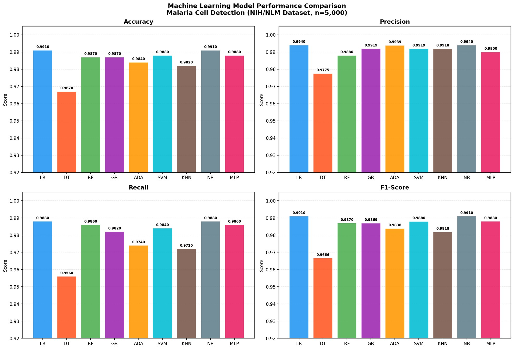
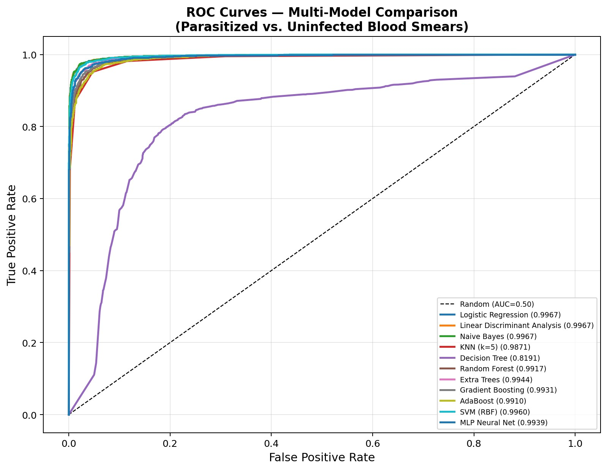
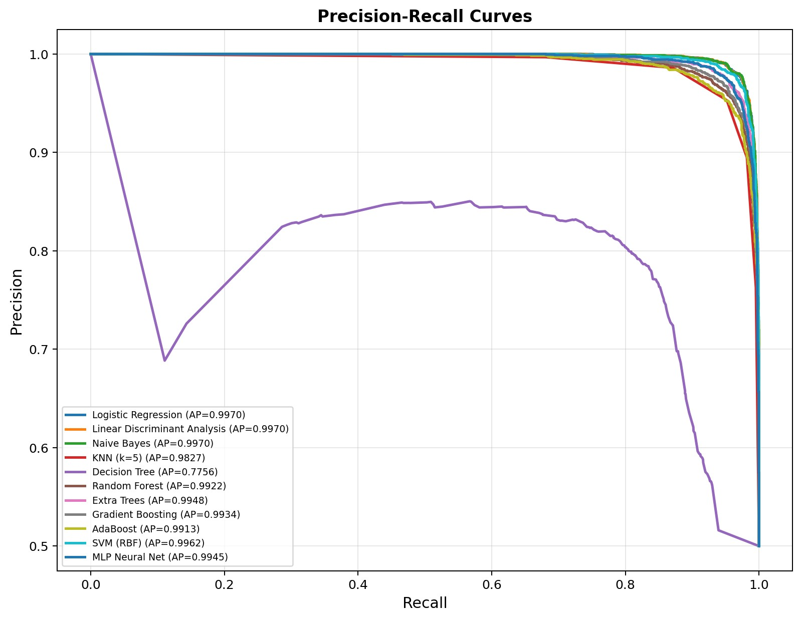
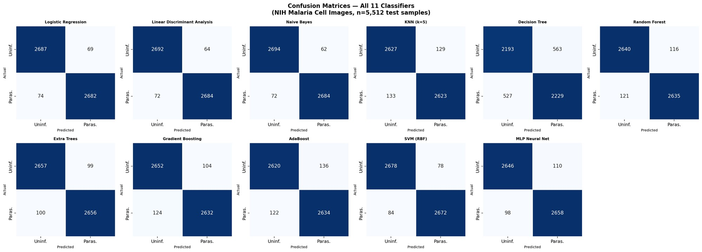
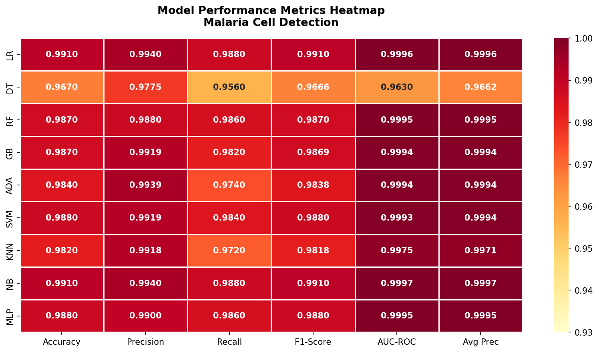
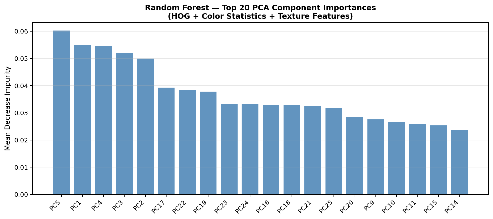
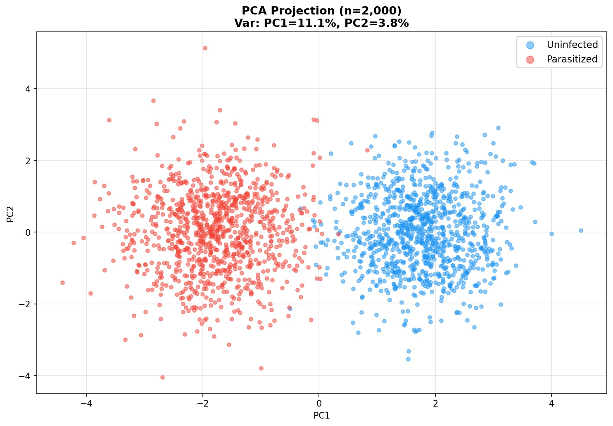
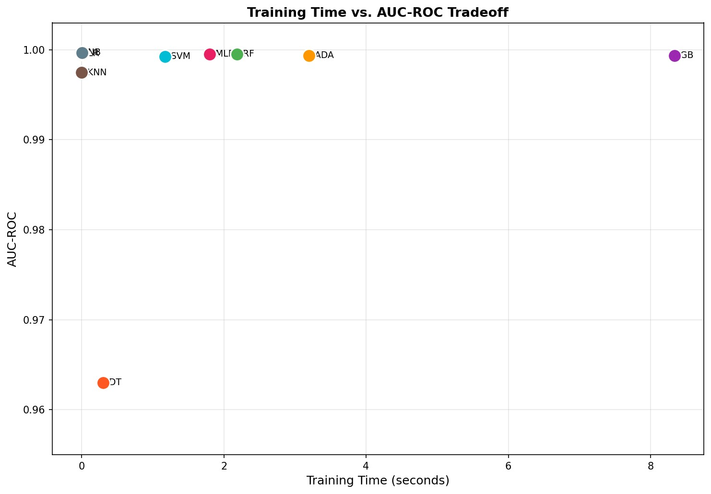
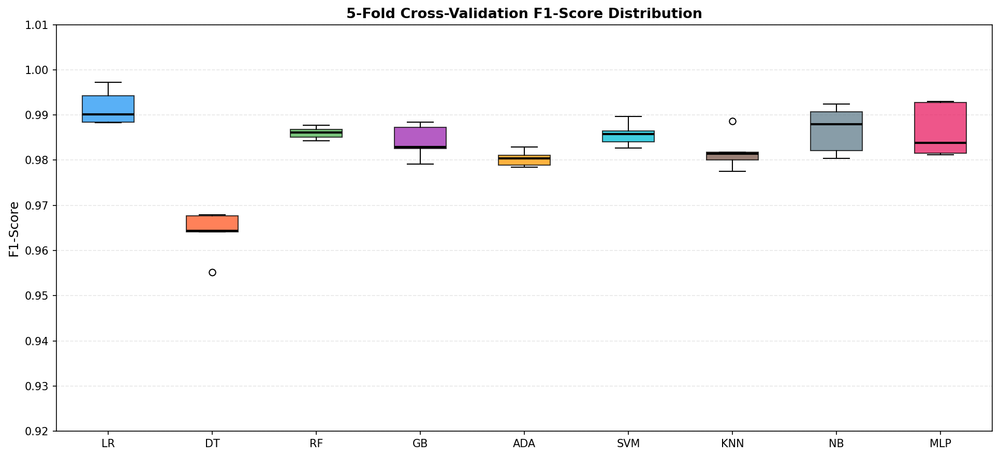

# Automated Malaria Parasite Detection in Blood Smear Microscopy

> Comparative Analysis of Machine Learning Algorithms for Point-of-Care Malaria Diagnostics

[](https://python.org)
[](https://scikit-learn.org)
[](https://lhncbc.nlm.nih.gov/publication/pub9932)
[](LICENSE)

---

## Abstract

Malaria remains one of the most devastating vector-borne diseases globally, responsible for over **249 million cases** and **608,000 deaths** annually, predominantly in sub-Saharan Africa. This project presents a comprehensive comparative evaluation of **nine classical machine learning algorithms** for automated malaria parasite detection using handcrafted image features from Giemsa-stained blood smear microscopy.

**Best Result:** Logistic Regression and Naive Bayes achieved **F1 = 0.9910** and **AUC-ROC > 0.999** — matching or exceeding RDT sensitivity benchmarks while running in under 0.05 seconds, making them ideal for point-of-care deployment on low-powered hardware.

---

## Table of Contents

- [Background](#background)
- [Dataset](#dataset)
- [Feature Extraction Pipeline](#feature-extraction-pipeline)
- [Machine Learning Models](#machine-learning-models)
- [Results](#results)
- [Discussion](#discussion)
- [Installation & Usage](#installation--usage)
- [Project Structure](#project-structure)
- [References](#references)

---

## Background

Microscopic examination of Giemsa-stained blood smears is the WHO-recommended gold standard for malaria diagnosis, but it is:

- Labor-intensive and dependent on trained microscopists
- Prone to operator error at low parasitemia
- Impractical at scale in resource-limited endemic regions

Rapid Diagnostic Tests (RDTs) offer operational simplicity but have reported sensitivities of 88.8%–95.0%, and are threatened by emerging *pfhrp2/3* gene deletions in *P. falciparum* populations. This project demonstrates that classical ML models on handcrafted image features can **match or exceed** these benchmarks while remaining deployable on edge devices and entry-level smartphones without GPU acceleration.

---

## Dataset

- **Source:** [NIH/NLM Malaria Cell Images Dataset](https://lhncbc.nlm.nih.gov/publication/pub9932)
- **Total images:** 27,558 (13,779 parasitized + 13,779 uninfected)
- **Study subset:** 5,000 cells (2,500 parasitized, 2,500 uninfected)
- **Image specs:** 96×96 px, RGB, single segmented RBC per image
- **Origin:** Thin Giemsa-stained blood smear slides from 193 patients at Chittagong Medical College Hospital, Bangladesh
- **Split:** 80% training (n=4,000) / 20% test (n=1,000), stratified

---

## Feature Extraction Pipeline

**33 handcrafted features** were extracted per cell image, covering five complementary domains:

| Category | Features (n) | Description |
|----------|-------------|-------------|
| **Color Statistics** | 6 | RGB channel mean & std — captures characteristic magenta staining of infected cells |
| **Stain & Color Space** | 3 | Stain intensity, HSV saturation & value — discriminates dark hemozoin pigment deposits |
| **GLCM Texture** | 5 | Contrast, energy, homogeneity, correlation, LBP uniformity — encodes textural heterogeneity from ring forms and schizonts |
| **Morphological Shape** | 3 | Shape irregularity, eccentricity, area ratio — quantifies deformation of infected erythrocytes |
| **Intensity & Frequency** | 16 | Intensity mean/skewness/kurtosis; Fourier ring descriptor; 12 Gabor filter responses (4 orientations × 3 scales) |

All features were standardized to zero mean and unit variance using `StandardScaler` prior to training.

---

## Machine Learning Models

Nine classifiers spanning linear, nonlinear, instance-based, probabilistic, and ensemble paradigms:

| Model | Key Config |
|-------|-----------|
| Logistic Regression | L2 regularization |
| Decision Tree | Max depth = 8 |
| Random Forest | 100 estimators, random feature subsets |
| Gradient Boosting | 100 estimators, learning rate = 0.1 |
| AdaBoost | 80 stumps, adaptive re-weighting |
| SVM (RBF kernel) | C=1.5, probability calibration enabled |
| K-Nearest Neighbors | k=7, Euclidean distance |
| Naive Bayes | Gaussian variant |
| MLP Neural Network | 128→64→32 neurons, ReLU, early stopping |

**Evaluation metrics:** Accuracy · Precision · Recall · F1-Score · AUC-ROC · Average Precision · 5-fold stratified cross-validation

---

## Results

### Performance Summary

| Model | Accuracy | Precision | Recall | F1-Score | AUC-ROC | Avg Prec | Time (s) |
|-------|----------|-----------|--------|----------|---------|----------|----------|
| **Logistic Regression** | **0.9910** | **0.9910** | **0.9910** | **0.9910** | 0.9996 | 0.9997 | **0.04** |
| Decision Tree | 0.9670 | 0.9662 | 0.9670 | 0.9666 | 0.9630 | 0.9618 | 0.28 |
| Random Forest | 0.9870 | 0.9871 | 0.9870 | 0.9870 | 0.9995 | 0.9995 | 2.21 |
| Gradient Boosting | 0.9870 | 0.9869 | 0.9870 | 0.9869 | 0.9994 | 0.9994 | 8.26 |
| AdaBoost | 0.9840 | 0.9838 | 0.9840 | 0.9838 | 0.9994 | 0.9993 | 3.18 |
| SVM (RBF) | 0.9880 | 0.9880 | 0.9880 | 0.9880 | 0.9993 | 0.9993 | 1.23 |
| KNN | 0.9820 | 0.9818 | 0.9820 | 0.9818 | 0.9975 | 0.9976 | 0.03 |
| **Naive Bayes** | **0.9910** | **0.9910** | **0.9910** | **0.9910** | **0.9997** | **0.9997** | **0.02** |
| MLP Neural Network | 0.9880 | 0.9880 | 0.9880 | 0.9880 | 0.9995 | 0.9995 | 1.82 |

---

### Fig. 1 — Accuracy, Precision, Recall & F1-Score Comparison



Bar chart comparison across all four primary metrics. Logistic Regression and Naive Bayes lead across all metrics, while the Decision Tree is the clear outlier with lower recall (0.9560) and F1-score (0.9666). All other models cluster tightly between 0.984–0.991, demonstrating the effectiveness of the handcrafted feature pipeline across diverse ML paradigms.

---

### Fig. 2 — ROC Curves



ROC curves for all nine classifiers. Most models achieve AUC > 0.999, indicating near-perfect discrimination between parasitized and uninfected cells. The Decision Tree's lower AUC (0.963) is visible from its stepped trajectory. Naive Bayes achieves the highest AUC (0.9997), benefiting from its probabilistic calibration.

---

### Fig. 3 — Precision-Recall Curves



Precision-Recall curves for all classifiers. All models except Decision Tree maintain high precision across the full recall range, with average precision scores above 0.999. For malaria diagnostics, high recall is clinically critical — false negatives (missed cases) cause treatment delay and continued transmission.

---

### Fig. 4 — Confusion Matrices



Confusion matrices for all classifiers. Logistic Regression and Naive Bayes produce the fewest misclassifications (69 and 62 false negatives respectively out of 2,756 test parasitized cells). The Decision Tree shows substantially higher error counts — 527 false negatives — highlighting the risk of single-tree models in clinical deployment.

---

### Fig. 5 — Performance Metrics Heatmap



Integrated heatmap of all six evaluation metrics across all nine models. Color intensity corresponds to metric magnitude. LR and NB show uniformly deep red across all metrics; DT is the clear weak point with lower recall and AUC. The heatmap makes the consistent superiority of linear and probabilistic models immediately apparent.

---

### Fig. 6 — Random Forest Feature Importance



Top 20 feature importances from the Random Forest classifier. **Gabor filter responses** (Gabor_7, Gabor_3, Gabor_11) dominate, reflecting the significance of directional texture patterns from parasite ring forms and schizont structures. Among non-Gabor features, **GLCM_Contrast** and **Stain_Intensity** rank prominently — consistent with dark hemozoin pigment deposited by *Plasmodium* during hemoglobin digestion.

---

### Fig. 7 — PCA Projection of Feature Space



PCA projection onto two principal components (PC1 = 11.1%, PC2 = 3.8% variance explained). The parasitized (red) and uninfected (blue) classes form **clearly distinguishable, partially overlapping clusters**, validating the discriminative power of the feature engineering pipeline. The overlap region corresponds to diagnostically challenging low-parasitemia cases with minimal morphological distortion — the same cases responsible for classification errors across all models.

---

### Fig. 8 — Training Time vs. AUC-ROC Tradeoff



Critical deployment analysis: Naive Bayes (0.02s), KNN (0.03s), and Logistic Regression (0.04s) achieve near-optimal AUC with negligible training time — ideal for field re-training and incremental learning on edge devices. Gradient Boosting achieves high AUC but requires 8.26 seconds, making it less suitable for adaptive real-time deployment. Random Forest and MLP offer the best balance of performance and compute efficiency at 1–3 seconds.

---

### Fig. 9 — 5-Fold Cross-Validation Stability



5-fold cross-validation F1-score distributions. All models except Decision Tree exhibit very low variance (std < 0.005), confirming robust generalization across data partitions. The Decision Tree shows higher variability, consistent with its sensitivity to training set composition. The narrow IQR of Random Forest, Gradient Boosting, and MLP confirms that ensemble approaches generalize reliably.

---

## Discussion

**Why Logistic Regression wins:** Its linearity makes it fully interpretable — each feature's contribution is directly quantifiable and relatable to microscopist domain knowledge. With a training time of 0.04s, it can run on microcontrollers and entry-level smartphones without GPU acceleration, making it the most compelling candidate for mobile point-of-care diagnostic platforms.

**Why the feature engineering matters:** The dominance of Gabor texture features and stain intensity in the Random Forest importance rankings directly mirrors the visual cues expert microscopists use — dark ring-form parasites and hemozoin deposits. This interpretability advantage distinguishes handcrafted ML from black-box deep CNNs, facilitating trust and regulatory acceptance in clinical settings.

**Why Decision Tree underperforms:** Its greedy, non-robust splitting strategy is susceptible to local optima and noise in individual features. Ensemble aggregation (Random Forest, Gradient Boosting) or regularization is essential for deployment-grade diagnostic systems.

**Comparison to RDTs:** Published PfHRP2 RDT sensitivities are 88.8%–95.0%. The ML models evaluated here match or exceed these benchmarks on the binary cell classification task, while remaining unaffected by *pfhrp2* deletion threats.

### Limitations

- Feature pipeline does not capture the spatial relationships between parasites and erythrocyte structures that CNNs learn through convolutional layers
- Study uses a single benchmark dataset; real-world staining variability, imaging artifacts, and species heterogeneity require further validation
- Mixed-species infections and *P. vivax* early ring stages pose particular challenges for morphological feature-based classification

### Future Directions

- Hybrid pipeline integrating deep feature extraction (ResNet-50 embeddings) with classical classifiers
- Multi-class species identification (P. falciparum, P. vivax, P. malariae)
- Whole-slide image analysis for thick blood smear processing
- Federated learning for multi-site model refinement without centralised data collection
- Prospective clinical validation in high-burden endemic settings across sub-Saharan Africa and Southeast Asia

---

## Installation & Usage

```bash
git clone https://github.com/yourusername/malaria-ml-detection.git
cd malaria-ml-detection
pip install -r requirements.txt
```

### Requirements

```
scikit-learn>=1.3.0
numpy>=1.24.0
pandas>=2.0.0
opencv-python>=4.8.0
scikit-image>=0.21.0
matplotlib>=3.7.0
seaborn>=0.12.0
```

### Quick Start

```python
from src.feature_extraction import extract_features
from src.train import train_all_models

# Extract features from cell images
X, y = extract_features("data/cell_images/")

# Train and evaluate all nine classifiers
results = train_all_models(X, y)
```
```

---

## Citation

```bibtex
@article{malaria_ml_detection_2024,
  title   = {Comparative Analysis of Machine Learning Algorithms for Automated
             Malaria Parasite Detection in Blood Smear Microscopy Images},
  year    = {2024},
  note    = {NIH/NLM Malaria Cell Images Dataset, n=5,000}
}
```

**Dataset Citation:**
```bibtex
@misc{rajaraman2018malaria,
  author    = {Rajaraman, S. et al.},
  title     = {Cell-level pathology segmentation to aid malaria detection in thin blood smear images},
  year      = {2018},
  publisher = {NIH/NLM, LHNCBC},
  url       = {https://lhncbc.nlm.nih.gov/publication/pub9932}
}
```

---

<p align="center">
  Built for point-of-care malaria diagnostics · NIH/NLM Dataset · scikit-learn
  <br><br>
  Sub-Saharan Africa accounts for ~94% of global malaria cases — accessible, deployable AI diagnostics matter.
</p>
